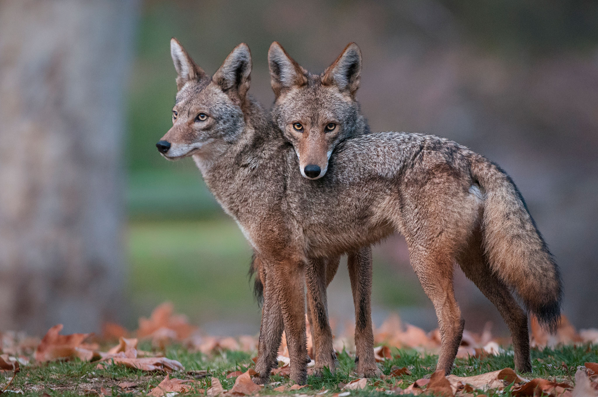

```{r setup, include=FALSE}
knitr::opts_chunk$set(echo = FALSE, message = FALSE, warning = FALSE)
library(knitr)
library(devtools)
library(twitteR)
library(wordcloud)
library(tidytext)
library(tidyverse)
library(streamR)
library(ROAuth)
library(reshape)
library(reshape2)
library(dplyr)
library(ggplot2)
library(splitstackshape)
library(plotly)
library(grid) 
library(lubridate)
```

# Twitter Analysis: Canada Goose
Living in Boston where is usually decorated in white (snow) for about 5 months, I really need to get armed to survive the winter. The temperature and wind get me into a fan of Canada Goose parka.  My "Mystique", the over-knee down jacket from Canada Goose, with the highest warmth level, is the warmest jacket I have ever owned. It is my source of confidence to get out in snowy day in Boston. I was quite happy to see a flagship store was under construction in prudential center and was looking forwards to stopping by after it opened. However, on November 24th, the day this flagship store was relased to the public, I witnessed a protest against Canada Goose for being cruelt to animals, such as coyote. I am curious about what others think about that. Since twitter is a very popular social media platform where people express their thoughts, I decided to feed my curiosity starting from twitter.


https://news.nationalgeographic.com/content/dam/news/2016/08/07/coyote-america/03coyote-america.jpg

```{r}
# connect to twitter
api_key <- 	"LFNRqX5i1PkB69SjEEncXWloq"
api_secret <- "4sDHqY6aLm7PRfJLxpq6GsWqphZxzX3dXLjssSLXYhO8wPwL3F"
access_token <- "11180082-wcpSmzCjbvj0csDhtYP5z32sqzrDhxROEPW9ZNAJY"
access_token_secret <- "mxdJoqVpb6dZPcTzko9YGcK1CbLmjKChCiJ5SpxKfDy7z"
  


setup_twitter_oauth(api_key, api_secret, access_token, access_token_secret)

load("my_oauth.Rdata")
```

```{r}
# get data from twitter
goose <- searchTwitter("CanadaGoose", n=2000, lang="en", since="2017-12-01")

tweets <- twListToDF(goose)
tweets$text<-iconv(tweets$text, from = "latin1", to = "ASCII", sub="")
tweets$text<-gsub('http\\S+\\s*', '', tweets$text)
write.csv(tweets,"goose.csv")
```

```{r}
# tokensize
tidy_tweets <- tweets %>% 
  unnest_tokens(word,text)

# remove stop words
data(stop_words)
tidy_tweets <-  tidy_tweets %>% 
  anti_join(stop_words)
```

# When do people tweet?
```{r}
tweets$date<-lubridate::date(tweets$created)
dayflowchart<-tweets%>%
  group_by(date)%>%
  summarise(numberoftweets=n())
ggplot(data=dayflowchart, aes(x=date, y=numberoftweets, group=1)) + 
    geom_line(colour="red", linetype="dashed", size=1.5) + 
    geom_point(colour="red", size=4, shape=21, fill="white")
```

People are more likely to tweet at weekend and there is a noticeable difference of tweets at weekend and weekdays. The protests and organized events online are usually take place at weekend. Thus, the increasing tweets numbers might be related to that.

# Map: Where people tweet
```{r}
filterStream("unitedmap.json", 
             track=c("CanadaGoose"), 
             locations = c(-125, 25, -66,50), 
             timeout=100, oauth=my_oauth)
netmap<-parseTweets("unitedmap.json", verbose = TRUE)
ck1 <- sum(netmap$lat>0, na.rm = TRUE)
ck2 <- sum(netmap$place_lat>0, na.rm = TRUE)
ck3 <- sum(!is.na(netmap$location))
map.data <- map_data("state")   
netpoints <- data.frame(x = as.numeric(netmap$lon),  
                       y = as.numeric(netmap$lat))
netpoints <- netpoints[netpoints$y > 25, ]  
netpoints<-filter(netpoints,y>19&y<65,x>(-161.7)&x<(-68.01))
ggplot(map.data) + 
  geom_map(aes(map_id = region),  
           map = map.data,  
           fill = "white",             
           color = "grey20", size = 0.25) + 
  expand_limits(x = map.data$long, y = map.data$lat) +            
  theme(axis.line = element_blank(),  
        axis.text = element_blank(),  
        axis.ticks = element_blank(),                     
        axis.title = element_blank(),  
        panel.background = element_blank(),  
        panel.border = element_blank(),                     
        panel.grid.major = element_blank(), 
        plot.background = element_blank(),                     
        plot.margin = unit(0 * c( -1.5, -1.5, -1.5, -1.5), "lines")) +  
        geom_point(data = netpoints,             
        aes(x = x, y = y), size = 1,  
        alpha = 1/5, color = "red") 
```

It seems that people living in cold states such Massachusetts are paying more attention to this animal issue. It is probaly because in those states there is a bigger potential market from heavyweight winter jacket.

# Word Frequency
```{r}
tidy_tweets %>%
  count(word, sort = TRUE) %>%
  filter(n > 100) %>%
  mutate(word = reorder(word, n)) %>%
  ggplot(aes(word, n)) +
  geom_col(colour="red") +
  xlab(NULL) +
  ylab("Count") +
  coord_flip()
```

I looked into the top words mentioned in tweets relevant to Canada Goose. Words refer to animal abuse, such as "ethical", "animal" and "coyotes" are the most popular.

# Word Cloud

Here is the word cloud for the top words in tweets.

```{r}
tidy_tweets %>%
  anti_join(stop_words) %>%
  count(word) %>%
  with(wordcloud(word, n, max.words = 100, colors = brewer.pal(8,"Dark2")))
```

# Sentiments

I am intereted in what kinds of attitude people have when they tweet. Therefore, I analysize the sentiments of words people use in there tweets.
```{r}
sentiments

get_sentiments("afinn")

get_sentiments("bing")

get_sentiments("nrc")

tweets_text<-tweets$text
tweets_text<-data_frame(text=tweets_text)
tweets_text<-tweets_text%>%unnest_tokens(word, text)
tweets_text<-tweets_text%>%
  inner_join(get_sentiments("nrc")) %>%
  count(word, sentiment, sort = TRUE) %>%
  ungroup()

tweets_text%>%
  group_by(sentiment) %>%
  top_n(10) %>%
  ungroup() %>%
  mutate(word = reorder(word, n)) %>%
  ggplot(aes(word, n, fill = sentiment)) +
  geom_col(show.legend = FALSE) +
  facet_wrap(~sentiment, scales = "free_y") +
  labs(y = "Sentiment Categories",
       x = NULL) +
  coord_flip()
```

```{r}
tweets_text<-tweets$text
tweets_text<-data_frame(text=tweets_text)
tweets_text<-tweets_text%>%unnest_tokens(word, text)
tweets_text<-tweets_text%>%
  inner_join(get_sentiments("bing")) %>%
  count(word, sentiment, sort = TRUE) %>%
  ungroup()

tweets_text%>%
  group_by(sentiment) %>%
  top_n(10) %>%
  ungroup() %>%
  mutate(word = reorder(word, n)) %>%
  ggplot(aes(word, n, fill = sentiment)) +
  geom_col(show.legend = FALSE) +
  facet_wrap(~sentiment, scales = "free_y") +
  labs(y = "Positive and Negative words",
       x = NULL) +
  coord_flip()
```

The plots indicates that people who have negative opinion speak louder online. In addition, the top word "ethical" is categorized as a positive word, but in this case it should be in the Team Protest and stands for negative feeling.

```{r}
tidy_tweets %>%
  inner_join(get_sentiments("bing")) %>%
  count(word, sentiment, sort = TRUE) %>%
  acast(word ~ sentiment, value.var = "n", fill = 0) %>%
  comparison.cloud(colors = c("#F8766D", "#00BFC4"),
                   max.words = 100)
```

The comparison cloud agrees with what I discussed above that people against Canada Goose and would like to take a boycott are more active online.

```{r}
attitude <- count(tweets_text, sentiment)
colnames(attitude) <- c("sentiment", "count")
kable(attitude)
summary(tweets_text)
kable(filter(tweets_text, n>quantile(tweets_text$n,0.9)))
```

The tables shows that the amount of tweets expressing negative feeling is extremely higher than that with positive view.

# Conclusion

The results indicates that more people are not happy with Canada Goose because of using real fur. However, what I can see in my real life is the popularity of Canada Goose parka is getting more and more popular, especailly on campus. Twitter might not be a good source to see whether the majority is holding positive or negative opinion. A survey might be a better choice since there are organizations, such as PETA, trying so hard to express and spread their idea against Canada Goose on social medium.


